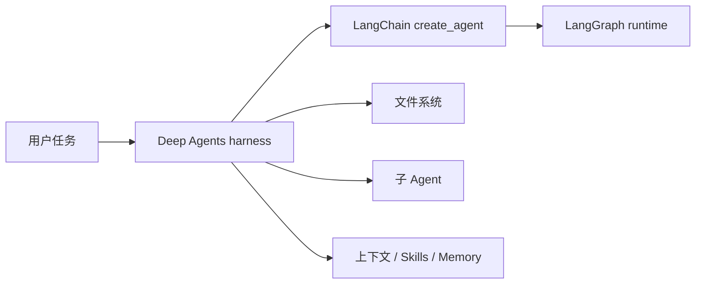

# Deep Agents 快速入门

本章用两个可运行示例认识 LangChain 的 `deepagents`：先让 Agent 调用一个函数，再让主 Agent 委派两个子 Agent、读写受限工作区并产出报告。

> 本教程按 `deepagents 0.7.13` 编写，要求 Python 3.11+。Deep Agents 仍处于 Beta，升级依赖前请查看官方 changelog。

## 1. Deep Agents 是什么

普通的工具调用 Agent 只有“模型判断 → 调工具 → 观察结果 → 继续判断”的循环。Deep Agents 在这个循环外预装了一套适合长任务的 harness：

- 文件系统：把资料和中间结果移出消息上下文；
- 子 Agent：把研究、审阅等任务放进隔离上下文；
- 上下文管理：自动处理过长历史和大型工具结果；
- Memory / Skills：分别加载长期规则和按需领域知识；
- Human-in-the-loop：在敏感工具调用前暂停等待批准；
- LangGraph runtime：提供持久执行、流式输出和中断恢复等底层能力。



怎么选：

| 需求 | 建议 |
|---|---|
| 简单问答或少量工具调用 | LangChain `create_agent` |
| 需要开箱即用的文件、委派和上下文管理 | Deep Agents |
| 工作流必须严格分支、并行或自定义状态 | 直接使用 LangGraph |

## 2. 安装

```bash
cd 15-deepagent
python3.11 -m venv .venv
source .venv/bin/activate
pip install -r requirements.txt
cp .env.example .env
```

编辑 `.env`，填入自己的 Key：

```dotenv
OPENAI_API_KEY=sk-...
DEEPAGENTS_MODEL=openai:gpt-5.5
```

模型名使用 `provider:model` 格式。也可以换成支持 tool calling 的其他 LangChain 模型，例如 `anthropic:claude-sonnet-4-6` 或 `google_genai:gemini-3.6-flash`，同时配置对应 API Key。Deep Agents 依赖中已包含 Anthropic 和 Google 集成；本章额外安装了 OpenAI 集成。

## 3. 第一个 Agent：自定义工具

运行：

```bash
python 01_quickstart.py
python 01_quickstart.py "上海天气如何？"
```

核心代码只有三步：

```python
from deepagents import create_deep_agent

agent = create_deep_agent(
    model="openai:gpt-5.5",
    tools=[get_weather],
    system_prompt="需要天气数据时必须调用 get_weather。",
)

result = agent.invoke(
    {"messages": [{"role": "user", "content": "北京天气如何？"}]}
)
print(result["messages"][-1].content)
```

这里最重要的不是天气函数，而是三个接口：

1. `create_deep_agent(...)` 组装模型、工具和 harness；
2. `invoke({"messages": [...]})` 运行一次 LangGraph；
3. `result["messages"][-1]` 取得最后一条模型消息。

普通 Python 函数就能成为工具。函数名、类型标注和 docstring 会帮助模型判断何时调用、参数怎么填，所以 docstring 应描述“工具做什么”，不要写模糊的实现细节。

## 4. 进阶例子：研究 + 审阅 + 写文件

运行：

```bash
python 02_research_team.py
python 02_research_team.py "写一份 Deep Agents 与普通 Agent 的对比"
```

这个例子演示三项 Deep Agents 内置能力：

### 4.1 自定义子 Agent

`subagents` 中声明了两个角色：

- `researcher` 可以调用 `read_course_notes` 收集事实；
- `reviewer` 负责读取草稿并提出修改意见，不需要资料工具；
- 主 Agent 通过内置 `task` 工具进行委派，再汇总结果。

子 Agent 适合多步骤、输出很长或需要专门指令的任务。单步问题不值得委派，因为额外模型调用会增加延迟和成本。

### 4.2 可插拔文件系统

```python
backend = FilesystemBackend(
    root_dir=str(WORKSPACE),
    virtual_mode=True,
)
```

主 Agent 与子 Agent 共享这个工作区，并可使用内置的 `ls`、`read_file`、`write_file`、`edit_file`、`glob`、`grep` 等工具。`virtual_mode=True` 会把虚拟路径 `/report.md` 映射到本章的 `workspace/report.md`，并阻止通过 `..`、`~` 或外部绝对路径逃出根目录。

默认的 `StateBackend` 不会直接写本地磁盘，适合作为单个 thread 内的临时草稿区；`FilesystemBackend` 会永久修改真实文件，因此只应指向专门目录。生产环境需要执行代码时，应使用隔离的 sandbox backend，不要直接给不可信请求开放本机 shell。

### 4.3 用提示词规定协作协议

框架提供“委派”能力，但不会自动知道你的流程。本例用 system prompt 明确规定：

1. `researcher` 收集事实；
2. 主 Agent 写 `/report.md` 草稿；
3. `reviewer` 审阅；
4. 主 Agent 修订并交付。

把角色边界、工具使用条件和交付格式写清楚，通常比继续增加 Agent 数量更有效。

## 5. 0.7 版本常见坑

- `create_deep_agent` 应显式传 `model`；依赖旧版默认模型会产生弃用警告。
- 从 0.7 起，任务清单不是默认能力。确实需要 `write_todos` 时再传入 `TodoListMiddleware()`。
- 默认 backend 是 thread 范围的 `StateBackend`；若没有 checkpointer，不要把它误认为跨运行的永久存储。
- Deep Agents 遵循“信任模型”的工具权限模型。安全边界应由 backend、sandbox、权限规则和人工批准实现，不能只靠 system prompt。
- `invoke` 返回完整状态，不只是字符串；最终文本通常在 `result["messages"][-1].content`。

按需启用任务清单：

```python
from langchain.agents.middleware import TodoListMiddleware

agent = create_deep_agent(
    model="openai:gpt-5.5",
    middleware=[TodoListMiddleware()],
)
```

## 6. 下一步

建议按这个顺序继续：

1. 把 `read_course_notes` 换成真实搜索、数据库或 MCP 工具；
2. 为同一 thread 添加 checkpointer，观察多轮状态如何恢复；
3. 给写文件、发消息、付款等副作用工具加入 human-in-the-loop；
4. 最后再引入 Skills、Memory、流式事件和生产部署。

官方资料：

- [Deep Agents Overview](https://docs.langchain.com/oss/python/deepagents/overview)
- [Quickstart](https://docs.langchain.com/oss/python/deepagents/quickstart)
- [Subagents](https://docs.langchain.com/oss/python/deepagents/subagents)
- [Backends](https://docs.langchain.com/oss/python/deepagents/backends)
- [GitHub 仓库](https://github.com/langchain-ai/deepagents)
